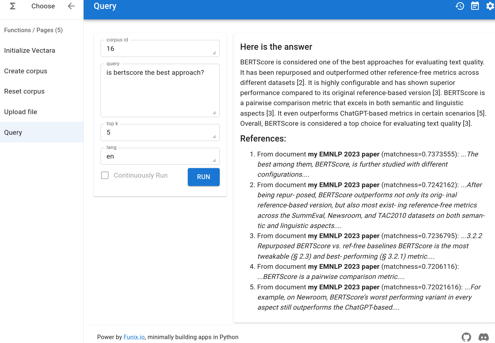

# An UNofficial Python SDK and CLI for Vectara's RAG platform 

It supports major features of Vectara's RAG platform for you to build your own search engine. 

Additional features: 
* It expands the upload function to allow you to upload a list of files or all files under a directory in one function call. 
* Renders query results in beautiful Markdown printout (see `demo.ipynb`).

## Installation

```bash
# Stable
pip install vectara

# Nightly
pip install "git+https://github.com/forrestbao/vectara-python-cli.git"
```

## Usage 

### Credentials

You can obtain the Vectara credentials following [this guide](https://docs.vectara.com/docs/learn/authentication/oauth-2). 
Then set up your Vectara credentials as environment variables. 

```bash
export VECTARA_CUSTOMER_ID=123
export VECTARA_CLIENT_ID=abc
export VECTARA_CLIENT_SECRET=xyz

# optional, if you are using a proxy like LlaMasterKey https://github.com/TexteaInc/LlaMasterKey/
export VECTARA_BASE_URL="http://127.0.0.1:8000/vectara"
```

This unofficial SDK and CLI will read your credentials from the environment variables above. The ability to pass in credentials as arguments is also supported.

### Python 
Try the Jupyter notebook `demo.ipynb` or read the docstring. 

```python
from vectara import vectara

client = vectara() # get default credentials from environment variables 
                   # You can also manually pass in your credentials as arguments

corpus_id = client.create_corpus('my knowledge base')

client.upload(corpus_id, 'one_file.pdf', description='My precious doc')  # add one file to the corpus 
client.upload(corpus_id, 'a_folder_of_documents') # add all files under a folder to the corpus
client.upload(corpus_id, ['user_manual.md', 'notes.txt'], description=['user manual', 'my memory']) # add a list of files to the corpus

client.query(corpus_id, 'Vectara allows me to search for anything, right?', top_k=5) # query the corpus for top 5 answers

client.reset_corpus(corpus_id) # delete all documents in the corpus
```

### Command line 
To learn the command line usage, run `vectara --help`. 

You must set up your Vectara credentials as environment variables before using the command line interface. 
    
```bash
# create a corpus
vectara create_corpus 'my knowledge base'
# output: corpus_id = 12

# upload a file to the corpus
vectara upload 12 one_file.pdf # corpurs_id = 12

# upload a folder to the corpus
vectara upload 12 ./a_folder_of_documents # corpurs_id = 12

# query the corpus
vectara query 12 'Vectara allows me to search for anything, right?' --top_k=5  # corpurs_id = 12

# reset the corpus
vectara reset_corpus 12 # corpurs_id = 12
```

### Web interface via Funix

The SDK can be converted into a web interface via [Funix](http://funix.io). You can drag and drop to add a file to your Vectara corpus. 

```python
pip install funix
funix src/vectara/__init__.py 
```

Then you can access the web interface at `http://localhost:3000` (the port number maybe different if port 3000 is occupied).

Below please find the screenshots 




**Known bugs**: Funix seems to have some memory leakage issues that the web interface may freeze after uploading a file. If that happens, please kill the process and restart the web interface.

### Stylish query results

The query results are typeset Markdown ready to be rendered. A query result includes the following info: 
* A summary with citations and matching scores with respect to the query
* References cited by the summary


```bash
### Here is the answer
To rearrange objects, you can utilize the "direction" attribute in a Funix decorator [1]. Manually resizing and positioning objects can be a tedious and inefficient process [2]. Another approach is to use a collision-free algorithm for auto-layout, where scopes will be resized to fit the objects inside [4]. An example of arranging objects in a column-reverse direction can be seen in the ChatGPT multiturn app [3]. Additionally, organizing your canvas with scopes can help in rearranging objects effectively [5]. Remember to experiment with these methods to find the best arrangement for your specific needs.

### References:
    
1. From document **funix.md** (matchness=0.673933):
  _...You can change their order and orientation using the "direction" attribute in a Funix decorator...._

2. From document **codepod.md** (matchness=0.65305215):
  _...It is painful and inefficient to resize and position the pods and scopes manually...._

3. From document **funix.md** (matchness=0.6520513):
  _...The example below shall be self-explaining:
A more advanced example is our ChatGPT multiturn app where "direction = "column-reverse"" so the message you type stays at the bottom...._

4. From document **codepod.md** (matchness=0.6495899):
  _...default}alt="Example banner"width="600"/>
After auto-layout, the pods and scopes are organized by a collision-free algorithm, and the scopes will be resized to fit the pods inside...._

5. From document **codepod.md** (matchness=0.6460015):
  _...Organize your Canvas with scopes..._
```

## Questions
Contact forrest at vectara dot com 

## Disclaimer
This is an UNofficial SDK and CLI for Vectara's RAG platform.
Use at your own risk.
Vectara does NOT provide support for this SDK or CLI.